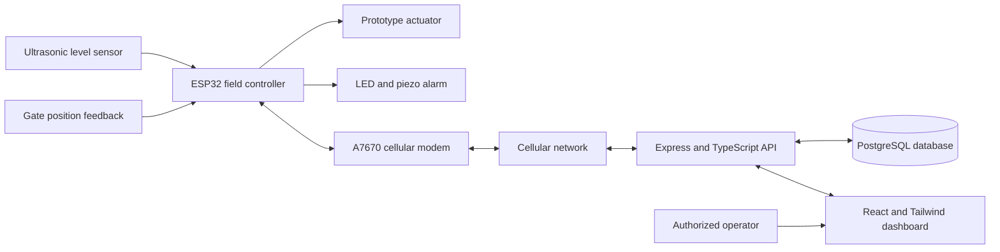
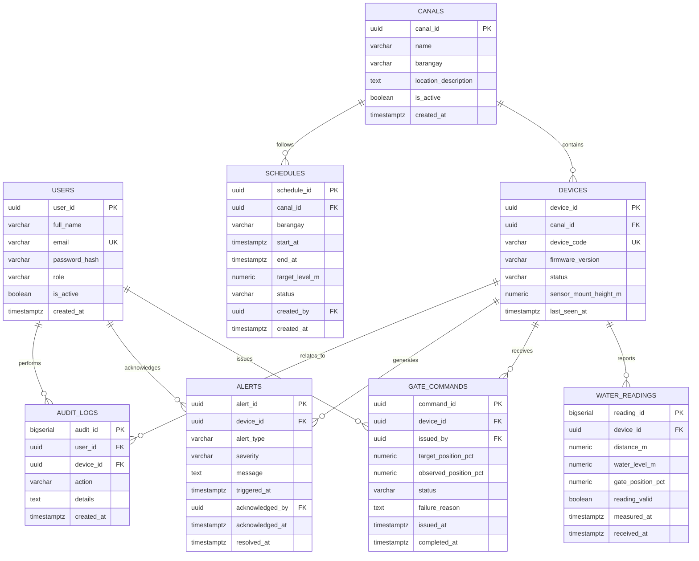

# IoT-Based Water-Level Monitoring and Automated Canal Gate Control System for the Pulangi River Irrigation System in Valencia City, Bukidnon

**Chapters 1–4 Draft**  
**Proponents:** [Insert names]  
**School / Department:** [Insert school and department]  
**Adviser:** [Insert adviser]  
**Date:** [Insert date]

> **Draft note:** No school-specific attachment or formatting guide was present in the workspace. This draft follows a conventional Chapters 1–4 capstone structure. Replace bracketed fields and validate the local situation, technical specifications, and test results with the project team. Chapter 4 contains evaluation templates, not claimed results.

# CHAPTER 1 — THE PROBLEM AND ITS BACKGROUND

## 1.1 Introduction

Irrigation canals must deliver water in a controlled and timely manner. At lateral canals serving multiple barangays, operators need to know the water condition, coordinate gate settings with rotation schedules, and respond when water rises or falls unexpectedly. When these tasks depend mainly on physical inspection and manual gate operation, visibility between inspections is limited and response depends on an operator being present.

This project is situated in the Pulangi River irrigation system serving barangays in Valencia City, Bukidnon. Based on the project proponents’ initial problem description, lateral canal gates are manually opened and closed, water levels are not continuously monitored, distribution during barangay rotations can be inconsistent, and administrators have limited remote visibility when a gate or canal condition changes. These conditions are the project’s stated local context and should be confirmed through interviews and site observation before final submission.

The proposed project, **IoT-Based Water-Level Monitoring and Automated Canal Gate Control System**, combines an ESP32, a non-contact water-level sensor, a SIMCom A7670 cellular module, a servo actuator for a scaled prototype gate, and a web application. The web application uses React and Tailwind CSS; the backend uses Express with TypeScript; and PostgreSQL stores device, measurement, schedule, command, and alert records. The system is intended to present timely readings, support authorized gate commands, compare water conditions against calibrated operating limits, and notify users of configured anomalies.

The proposed sensor measures **water level**, not volumetric flow. A water-level reading can help operators understand canal conditions, but it cannot by itself establish a flow rate in units such as liters per second or cubic meters per second. Direct flow measurement would require a suitable flow sensor or a validated hydraulic calculation using additional channel geometry and velocity data.

## 1.2 Current Situation or Existing Process

Under the process described by the proponents, a person travels to a lateral gate, visually checks the canal, and manually changes the gate opening according to operational needs or a rotation schedule. Administrators generally receive information through periodic inspection or communication from field personnel rather than a continuous digital view of each monitored gate.

This process can work when personnel are available and conditions remain stable. It becomes harder to coordinate when water conditions change between visits, when several barangays share a rotation schedule, or when the responsible administrator is away from the site. The project will document the actual inspection frequency, decision process, schedule rules, and existing communication methods during requirements gathering; those local facts are not assumed in this draft.

## 1.3 Problems Encountered

The initial problem statement identifies the following concerns:

1. **Labor-intensive gate operation.** Operators must be physically present and exert effort to change gate position.
2. **Limited real-time water-level information.** Without continuous measurement, a developing overflow or shortage may not be visible until an inspection or report occurs.
3. **Uneven distribution during rotations.** A schedule alone does not confirm that a gate was set as intended or that canal conditions match the intended operating condition.
4. **No reliable unauthorized-opening detection.** A remote command log does not prove the gate’s actual physical position. Detecting an uncommanded movement requires a gate-position sensor or equivalent feedback mechanism.
5. **Limited remote oversight.** Administrators lack a consolidated, time-stamped view of readings, commands, device connectivity, and alerts.

These issues are the basis for the project, not findings from a completed field study. The proponents should verify and refine them with local irrigation personnel and observations.

## 1.4 Why an IoT-Based Solution Is Needed

An Internet of Things (IoT) system can connect field sensors and actuators to a backend that receives, stores, and presents device data. For this project, cellular connectivity is considered because the monitoring point may not have dependable Wi-Fi access. The ESP32 can collect sensor input and coordinate local control, while the A7670 provides a cellular communication path when the selected module variant, SIM, antenna, carrier service, and local coverage support the required connection.

A remote monitoring system can reduce reliance on repeated site visits for routine status checks and can make readings and gate commands visible to authorized users. It can also preserve a record of measured levels and attempted actions for later review. IoT does not remove the need for trained operators, a safe manual override, physical inspection, or a tested fail-safe design. Cellular outages, sensor faults, incorrect thresholds, power problems, and mechanical failures must be considered in the design.

## 1.5 How IoT Can Improve the Existing Process

The proposed system is designed to improve the process in these ways:

- Collect and time-stamp water-level readings at a configurable interval.
- Transmit measurements and device status to the backend over a supported cellular data connection.
- Display current and historical readings, gate status, connectivity, schedules, and alerts on a web dashboard.
- Allow authorized users to request a gate movement and record the user, time, target, and result.
- Compare measurements with locally approved thresholds and raise an alert when a configured condition occurs.
- Preserve an event history that can support review of rotation schedules and anomalies.
- Continue local safety checks during temporary connectivity loss; do not depend on the cloud connection as the only means of preventing unsafe movement.

Automation will only be enabled after sensor calibration, actuator testing, and approval of operating limits by the responsible irrigation personnel. For a prototype, automatic movement should be demonstrated on a scaled model or test rig rather than an operational canal gate.

## 1.6 Proposed System

The field unit measures canal water level with a non-contact ultrasonic sensor and reads gate-position feedback. The ESP32 filters and validates readings, applies local control rules, and communicates with the backend through the A7670 cellular modem. The backend validates incoming device messages, stores them in PostgreSQL, evaluates alerts, and exposes authenticated API endpoints. The React and Tailwind CSS dashboard presents the data to administrators and authorized operators.

A user command travels from the dashboard to the Express API and then to the field device. The device must validate the command, check its local safety conditions, move the prototype actuator only when permitted, and report the observed result. A command is not considered successful merely because it was sent: the system should compare requested movement with gate-position feedback.

### Proposed project components

| Component                                              | Proposed role                                                             | Design note                                                                                                                                           |
| ------------------------------------------------------ | ------------------------------------------------------------------------- | ----------------------------------------------------------------------------------------------------------------------------------------------------- |
| ESP32                                                  | Sensor acquisition, local control, and device coordination                | Exact board and firmware environment must be specified.                                                                                               |
| Non-contact ultrasonic water-level sensor              | Measures distance to the water surface for calibrated level calculation   | Select a waterproof model appropriate for outdoor canal use; protect the sensor from rain, splash, condensation, and mounting vibration.              |
| SIMCom A7670 module                                    | Cellular data communication                                               | Confirm the exact A7670 variant, supported bands, carrier coverage, antenna, SIM plan, interface, and power requirements.                             |
| Servo                                                  | Moves a scaled prototype gate                                             | A hobby servo is not assumed suitable for a full-size gate. Real gates require mechanical and actuator engineering.                                   |
| Gate-position feedback sensor (additional requirement) | Confirms actual gate position and helps detect uncommanded movement       | Add a limit switch, encoder, or suitable position sensor. The listed components do not include this feedback.                                         |
| 12 V battery and power supply                          | Supplies the system through appropriately rated conversion and protection | Do not connect 12 V directly to ESP32, modem, or a lower-voltage servo. Design regulated rails and separate high-current actuator supply as required. |
| Red LED and resistor                                   | Local warning indicator                                                   | Use a current-limiting resistor selected for the LED and output voltage.                                                                              |
| Piezo buzzer                                           | Local audible alarm                                                       | Drive within its electrical rating; use a suitable driver if required.                                                                                |
| Breadboard and jumper wires                            | Prototype interconnection                                                 | Not appropriate as permanent outdoor canal installation wiring. Use protected enclosures and robust connectors for field deployment.                  |

**Required design additions:** gate-position feedback; regulated power conversion and protection; an outdoor enclosure and mounting; and, if actual flow rate is a project requirement, a flow-measurement method. Final sensor and actuator models must be selected from verified datasheets.

## 1.7 Objectives of the Study

### General objective

To design, develop, and evaluate a prototype IoT-based system for monitoring canal water level and supporting remote, logged control of a scaled lateral-canal gate for the Pulangi River irrigation context in Valencia City, Bukidnon.

### Specific objectives

1. To document the existing gate-operation process, user needs, rotation-schedule requirements, and field constraints through consultation and observation.
2. To design a prototype integrating an ESP32, non-contact water-level sensor, cellular communication module, gate actuator, gate-position feedback, and local alarms.
3. To develop a web dashboard using React and Tailwind CSS and a TypeScript Express API connected to PostgreSQL.
4. To implement authorized measurement reporting, command logging, threshold alerts, and device-status monitoring.
5. To test sensor accuracy against a reference measurement, telemetry delivery, dashboard/API behavior, actuator response, alert behavior, and recovery from connectivity interruption.
6. To assess whether the prototype meets acceptance criteria established with the adviser and relevant irrigation stakeholders.

## 1.8 Significance of the Study

- **Irrigation administrators:** A consolidated record of water-level readings, device status, commands, and alerts can support oversight and follow-up.
- **Gate operators:** Remote status visibility and logged commands may reduce unnecessary inspection trips for routine checks, while preserving operator authority and manual procedures.
- **Barangay water users:** Better visibility of canal conditions and documented schedule-related events may support more transparent coordination. The project does not guarantee equal water delivery without field validation and operational policy changes.
- **Future researchers:** The design and test results can provide a basis for studying low-cost telemetry, water-level monitoring, gate automation, and field reliability in irrigation settings.

## 1.9 Scope and Limitations

The project scope is a prototype for water-level monitoring, remote status reporting, alerting, and controlled movement of a **scaled gate model**. It includes a React/Tailwind frontend, a TypeScript/Express backend, PostgreSQL persistence, ESP32 firmware, and cellular communication through a compatible A7670 configuration.

The project does not establish a production-ready or safety-certified control system for an actual Pulangi River gate. It does not guarantee crop yield, equitable water allocation, prevention of water theft, or continuous cellular service. Actual deployment requires stakeholder approval, site and hydraulic studies, environmental protection, power and network surveys, cybersecurity review, mechanical design, and operational safety procedures.

The core sensor described here measures water level, not water flow rate. The components list does not include physical gate-position feedback, so unauthorized opening cannot be reliably detected until such a sensor is added. Prototype servo torque and durability are not assumed adequate for a real canal gate. Results will be limited to the tested hardware, location, network, calibration, and conditions.

## 1.10 Definition of Terms

- **A7670:** A SIMCom cellular module family; the exact variant and supported network features must be verified for the purchased module.
- **Canal water level:** The vertical height of water relative to a defined reference point in the canal.
- **Cellular telemetry:** Transmission of measurement and status data through a mobile network.
- **Gate-position feedback:** A sensor measurement indicating the physical position of a gate or prototype gate.
- **IoT:** A system of physical devices that sense, communicate, and may act on data through a networked software service.
- **Lateral canal:** A branch channel that distributes irrigation water from a larger canal to a service area.
- **Ultrasonic distance measurement:** Estimation of distance from an emitted sound pulse’s travel time; water level is calculated from sensor mounting height and measured distance.
- **Water flow rate:** The volume of water passing a cross-section per unit time, such as liters per second. It is not measured by the proposed level sensor alone.

# CHAPTER 2 — REVIEW OF RELATED LITERATURE AND SYSTEMS

## 2.1 Irrigation Monitoring and Water Distribution

Irrigation management depends on observing water conditions and coordinating infrastructure operation with water demand and distribution rules. Manual inspection provides direct local observation but offers limited continuity between site visits. A monitoring system can make measurements available to remote users and retain a time series for later analysis. However, sensor readings are only useful when their location, calibration, sampling interval, and relation to operating decisions are understood.

For the Pulangi River irrigation context, the project’s reported concerns center on manual lateral gate operation, lack of continuous level monitoring, rotation coordination, and limited administrator visibility. The proponents should use interviews and site observation to determine which readings and alerts are genuinely useful to local operators rather than assuming that a generic threshold or schedule will fit every lateral canal.

## 2.2 IoT-Based Monitoring and Control

An IoT monitoring-and-control arrangement commonly has four functional layers: field sensing and actuation, a communication link, a backend service, and a user interface. In this design, the ultrasonic sensor and position sensor provide field observations; the ESP32 performs local processing; the A7670 provides cellular communication; the Express backend validates and stores data; PostgreSQL maintains a persistent record; and the React dashboard presents status and accepts authorized requests.

Separating these responsibilities makes failures easier to reason about. For example, a sensor reading can be valid even if transmission fails, and a received command can be logged even if the actuator does not reach its target. The system should distinguish these states rather than presenting a single “online” or “success” value.

## 2.3 Water-Level Sensing

A non-contact ultrasonic sensor estimates the distance between its transducer and the water surface. If the sensor is installed at a known height above a reference datum, the water level can be calculated from that height and the measured distance. For example, if the sensor reference height is $H_s$ and measured distance is $D$, then the estimated level relative to the datum is $H = H_s - D$. This calculation is valid only after the installation datum and channel reference have been defined.

Ultrasonic readings can be affected by sensor angle, turbulence, foam, condensation, temperature, mounting movement, and obstructions. The sensor should be mounted above the highest expected water level and tested against manual reference measurements over the intended range. Invalid or implausible readings must be marked as invalid, not silently converted into a safe level. A waterproof sensor suited to the environment should be chosen; a generic indoor ultrasonic module should not be assumed suitable for permanent canal use.

A level sensor does not directly measure flow rate. Flow rate depends on water velocity and the cross-sectional area, and in open channels may also depend on channel geometry and flow conditions. If the project objective is to report a quantitative flow rate, the team must add an appropriate flow sensor or conduct a validated hydraulic measurement study.

## 2.4 Microcontroller and Cellular Communication

Espressif identifies the ESP32 family as a microcontroller platform with integrated connectivity and peripherals suitable for embedded applications. The project uses the ESP32 to read sensors, apply local rules, drive a prototype actuator, and coordinate communications. The manufacturer’s documentation should guide board-specific electrical limits, pin selection, firmware setup, and peripheral use.

SIMCom’s A7670 product resources include hardware design and application documents for the A76XX/A7670 families. Because A7670 variants can differ, the implementation must use the documentation for the exact purchased model. The team should verify supported cellular bands and technology, carrier compatibility, antenna, SIM provisioning, UART or other interface requirements, modem startup behavior, peak current needs, and the chosen data protocol. Cellular availability and latency must be tested at the intended site.

## 2.5 Gate Actuation and Safety

A servo can demonstrate position control on a small model gate, but the capability of a full-size irrigation gate depends on gate mass, water force, friction, geometry, required travel, duty cycle, and environmental exposure. Therefore a hobby servo in a breadboard prototype must not be represented as a field-ready gate actuator.

Reliable control needs both a requested target and feedback describing the actual gate position. Without feedback, the controller can report that it issued a command but cannot confirm that the gate moved or detect an independent physical opening. A limit switch, encoder, or other engineered position sensor is therefore a required addition for the proposed unauthorized-movement alert. Safe operation should include upper/lower travel limits, timeout handling, interlocks, command authorization, local manual override, and a defined response to sensor, power, or network failure.

## 2.6 Web Application and Database Technologies

React is used to build the interactive dashboard from reusable interface components. Tailwind CSS supplies utility classes for styling. The dashboard should present current level, measurement age, connectivity, gate position, schedules, alerts, and command history with clear stale-data indicators.

Express is a Node.js web framework suitable for defining API routes and middleware. TypeScript adds static type checking to application code but does not replace runtime validation of incoming device messages or user requests. The API should authenticate users and devices, validate inputs, enforce permissions, and avoid trusting commands or telemetry solely because they arrived over a network.

PostgreSQL is a relational database appropriate for structured entities and relationships such as devices, readings, schedules, commands, and alerts. Primary keys and foreign keys can preserve those relationships. Timestamps should be stored consistently, preferably in UTC, with the display layer rendering an appropriate local time. Indexes should be considered for common queries by device and time range.

## 2.7 Related Systems and Research Gap

Existing remote irrigation approaches generally combine sensing, communication, and remote display or control. This project applies that general pattern to a local lateral-canal use case and adds explicit schedule records, operator attribution, gate-position feedback, and alert history to the proposed data design. No specific local deployment study or measured performance result was supplied for this draft; the proponents should add verified related studies from their institution’s library or scholarly databases before final submission.

The project gap addressed here is the lack of an integrated prototype tailored to the stated workflow: water-level visibility, rotation-related records, cellular remote access, and traceable gate commands in one system. Its contribution must be evaluated by prototype tests and stakeholder feedback, not inferred from the design alone.

## 2.8 Conceptual Framework

The project follows an Input–Process–Output (IPO) framework.

| Input                                                                                                                           | Process                                                                                                                                                                       | Output                                                                                                                   |
| ------------------------------------------------------------------------------------------------------------------------------- | ----------------------------------------------------------------------------------------------------------------------------------------------------------------------------- | ------------------------------------------------------------------------------------------------------------------------ |
| Ultrasonic distance reading; gate-position feedback; device identity; approved schedule and thresholds; authorized user command | Validate and calibrate readings; derive water level; compare against limits; transmit data; store records; validate authorization; apply actuator interlocks; evaluate alerts | Dashboard readings and status; gate command and observed result; alert notifications; historical records and audit trail |

**Feedback:** Operator review, sensor calibration, and observed test results are used to revise thresholds and prototype behavior. No operating thresholds are prescribed by this document; they must be established with responsible stakeholders.

# CHAPTER 3 — METHODOLOGY AND SYSTEM DESIGN

## 3.1 Development Method

The project will use an iterative prototyping method. The team will first confirm user requirements and field constraints, then assemble a low-voltage bench prototype, implement telemetry and the web application, conduct controlled tests, and revise the design based on test evidence. Any test involving water or moving hardware should use a contained test rig with an accessible power disconnect and a manual stop.

The project will not connect an unvalidated prototype to an operational irrigation gate. Field installation, if later proposed, requires separate engineering review and authorization.

## 3.2 Requirements-Gathering Methods

The proponents should conduct and document:

- Interviews with irrigation administrators and gate operators about inspection routines, rotation schedules, alert response, and manual override expectations.
- Site observation of the selected canal or a documented representative location, including mounting options, water-surface behavior, power availability, cellular signal, and environmental exposure.
- Review of existing operational forms, schedules, or incident records where access is authorized.
- Requirements validation with stakeholders before thresholds, permissions, and acceptance criteria are finalized.

**Participants / location / dates:** [Insert approved participants, study site, dates, and consent or authorization process. Do not invent sample size or interview findings.]

## 3.3 System Architecture

The firmware should continue local safety checks regardless of backend availability. The backend and dashboard provide monitoring and authorized requests, but a remote connection must not bypass local travel limits or safety interlocks.

## 3.4 Hardware Design

### Hardware functions

1. The ultrasonic sensor measures distance to the water surface.
2. The ESP32 validates the sensor result and derives a water-level estimate using a surveyed sensor reference height.
3. The ESP32 reads gate-position feedback and compares actual position with the requested position.
4. The A7670 transmits readings, device health, and command results using a data method supported by the selected module and network.
5. The Express backend stores readings and events and makes authorized information available to the dashboard.
6. The LED and piezo provide local indication for configured warnings or faults.

### Power and installation requirements

A 12 V battery must feed suitable regulated converters and protection circuits. The ESP32, A7670 board, and servo must each receive their required voltage and sufficient current according to their exact datasheets and development-board design. Modem transmit current peaks and servo stall current must be accounted for. Grounds and signal voltage levels must be compatible; use level shifting or interface circuitry where required. Do not assume the breadboard can safely distribute high actuator or modem currents.

For a field version, replace breadboard wiring with secured connectors and an enclosure appropriate to water, humidity, sunlight, corrosion, and insects. Provide fuse protection and a way to isolate power. A site survey should confirm solar or battery runtime needs if mains power is unavailable.

## 3.5 Software Design

### Frontend

The React and Tailwind CSS dashboard is intended to include:

- A site/device overview with latest water level, reading timestamp, data freshness, cellular status, and gate position.
- A historical readings view with selectable date range.
- A rotation-schedule view and the status of relevant scheduled periods.
- An alert list with severity, trigger time, device, acknowledgement, and resolution status.
- A gate-control panel limited to authorized users, with confirmation, command state, timeout, and observed position.
- A user and role administration view for authorized administrators.

### Backend

The Express and TypeScript API is intended to provide authenticated endpoints for device telemetry, device health, schedules, gate commands, alert acknowledgement, and history queries. Runtime schema validation should be applied to all incoming payloads. Device credentials and user passwords must not be stored in plaintext. Use HTTPS/TLS in deployment, least-privilege authorization, rate limits where appropriate, and audit records for sensitive actions.

### Communication and outage behavior

The device should attach a unique device identifier and timestamp or sequence number to each message. If cellular service is unavailable, the prototype should retain a bounded queue of readings or report data loss explicitly; it must not falsely present delayed readings as current. Commands should expire, include unique identifiers to prevent accidental duplicate execution, and receive an explicit accepted/rejected/completed/failed status. The exact transport, retry interval, queue capacity, and command expiry will be selected and documented during implementation.

## 3.6 Database Design

The following ERD is a proposed logical design. It can be rendered visually by a Markdown viewer that supports Mermaid. Relationships and fields should be adjusted to the implemented API and approved workflow.

### Data integrity notes

- Store water-level values with units and document the reference datum.
- Keep both the device measurement time and server receipt time to identify delayed telemetry.
- Constrain command status values to a documented set such as `pending`, `accepted`, `completed`, `rejected`, `expired`, or `failed`.
- Store password hashes only; never store raw passwords.
- Use a separate device authentication credential or certificate rather than sharing a user login.
- Consider uniqueness and indexes for device code, email, device/time readings, and active schedule lookups.
- Retention and access policies should be approved before collecting data from a real site.

## 3.7 Proposed Operating Logic

1. Read the ultrasonic sensor and gate-position sensor.
2. Reject values outside the sensor’s calibrated range or values marked invalid by the acquisition logic.
3. Calculate water level using the surveyed reference height; attach measurement and receipt timestamps.
4. Compare the valid level against thresholds approved by the responsible stakeholders.
5. Generate a local or remote alert when the reading crosses a configured threshold, when readings become stale, or when actual gate position changes without a matching active command.
6. On a gate command, verify user authorization at the backend and validate command identifier, expiry, and target bounds at the device.
7. Check local interlocks and limits before actuator movement. Stop or reject a command if feedback is absent, inconsistent, or unsafe.
8. Verify the resulting position using feedback; report the result rather than assuming the requested position was reached.
9. If communication is lost, preserve local safety behavior, mark remote data stale, and follow the stakeholder-approved local control policy. Never assume that loss of connectivity is permission to open or close a gate.

## 3.8 Reserved Space for Code and Implementation Artifacts

**Firmware source code (ESP32):**  
[Insert code listing, repository link, or figure reference here.]

**Backend source code (Express / TypeScript):**  
[Insert code listing, repository link, or figure reference here.]

**Frontend source code (React / Tailwind CSS):**  
[Insert code listing, repository link, or figure reference here.]

**Database migration / schema:**  
[Insert schema listing or repository link here.]

## 3.9 Test Plan and Proposed Acceptance Criteria

Before testing, the proponents and adviser should set numeric acceptance limits based on sensor specifications and project requirements. The values below are deliberately left for the team to establish rather than invented here.

| Test area             | Procedure                                                                                      | Measure / evidence                                       | Acceptance criterion                          |
| --------------------- | ---------------------------------------------------------------------------------------------- | -------------------------------------------------------- | --------------------------------------------- |
| Level measurement     | Compare sensor-derived levels against a ruler or reference instrument at multiple known levels | Error per point; mean absolute error                     | [Set maximum error and test range]            |
| Reading validity      | Introduce conditions such as no echo, obstruction, or out-of-range distance                    | Invalid-read handling and alert/log record               | [Define expected invalid-state behavior]      |
| Telemetry             | Send readings at the configured interval under available cellular coverage                     | Delivery success, latency, missing/duplicate messages    | [Set delivery and latency targets]            |
| Stale-data indication | Interrupt the network and observe dashboard state                                              | Time until marked stale; display correctness             | [Set stale threshold]                         |
| Gate movement         | Issue bounded test commands on the scaled rig                                                  | Command-to-position error; movement time; limit behavior | [Set tolerance and time limit]                |
| Unauthorized movement | Move the model without an active command                                                       | Feedback detection and alert creation                    | [Define detection time and alert requirement] |
| Threshold alert       | Simulate readings above/below approved limits                                                  | Trigger accuracy and notification record                 | [Set threshold behavior]                      |
| Schedule operation    | Create and review a test rotation schedule                                                     | Correct time-window and access behavior                  | [Define expected schedule behavior]           |
| Access control        | Attempt permitted and prohibited actions with test roles                                       | API response and audit record                            | [Define role matrix]                          |
| Power behavior        | Test expected supply conditions and controlled power interruption                              | Reboot/recovery, data integrity, safe actuator state     | [Define safe state and recovery criteria]     |

# CHAPTER 4 — SYSTEM PRESENTATION, TESTING, AND RESULTS

## 4.1 Chapter Status

This chapter is a results template because no completed prototype, field measurements, screenshots, or test logs were supplied. The placeholders must be completed after the system is built and evaluated. Do not report projected values as measured results.

## 4.2 Prototype Presentation

Insert photographs or screenshots of the completed prototype and label each figure. Include the sensor mounting, ESP32 and modem wiring, regulated power supply, gate-position feedback, scaled gate rig, dashboard, and alert/history views. Do not show wiring as field-ready unless the installation has been properly enclosed and reviewed.

**Figure 4.1. Prototype hardware**  
[Insert labeled photograph and short description.]

**Figure 4.2. Dashboard overview**  
[Insert screenshot and short description.]

**Figure 4.3. Water-level history and alerts**  
[Insert screenshot and short description.]

**Figure 4.4. Gate command and observed position**  
[Insert screenshot and short description.]

## 4.3 Test Environment and Procedure

- **Test location:** [Insert lab, workshop, or approved test site]
- **Test dates:** [Insert dates]
- **Hardware versions:** [Insert ESP32 board, sensor model, A7670 variant, actuator, feedback sensor, and power-converter models]
- **Software versions:** [Insert firmware, frontend, backend, and database versions]
- **Cellular carrier and coverage conditions:** [Insert non-sensitive test description]
- **Reference instrument and calibration method:** [Insert instrument, resolution, and procedure]
- **Number of trials:** [Insert actual number and justification]

Conduct repeatable tests using a controlled water-level rig. Record the reference level, sensor estimate, timestamps, network condition, gate target, measured gate position, and outcome for each trial. Record failures and exclusions with reasons. Obtain permission and protect personal or operational data if the tests involve a real site or users.

## 4.4 Results Template

### Water-level measurement accuracy

|               Trial | Reference level (m) | System level (m) |             Absolute error (m) | Conditions / notes |
| ------------------: | ------------------: | ---------------: | -----------------------------: | ------------------ |
|                   1 |                 [ ] |              [ ] |                            [ ] | [ ]                |
|                   2 |                 [ ] |              [ ] |                            [ ] | [ ]                |
|                   3 |                 [ ] |              [ ] |                            [ ] | [ ]                |
|                 ... |                 [ ] |              [ ] |                            [ ] | [ ]                |
| Mean absolute error |                   — |                — | [Calculate from actual trials] | —                  |

For $n$ valid trials, calculate mean absolute error as $MAE = \frac{1}{n}\sum_{i=1}^{n}|y_i-\hat{y}_i|$, where $y_i$ is the reference level and $\hat{y}_i$ is the system estimate. State how invalid trials were handled.

### Functional and integration testing

| Test case                    | Expected result                                                        | Actual result / evidence             | Pass / fail |
| ---------------------------- | ---------------------------------------------------------------------- | ------------------------------------ | ----------- |
| Device sends a valid reading | Reading is received, timestamped, stored, and displayed                | [Insert observation / log reference] | [ ]         |
| Invalid sensor reading       | Reading is flagged invalid and is not shown as a valid current level   | [Insert observation / log reference] | [ ]         |
| Cellular connection lost     | Data freshness is indicated; local safety behavior remains active      | [Insert observation / log reference] | [ ]         |
| Authorized gate command      | Command is authenticated, bounded, logged, and verified using feedback | [Insert observation / log reference] | [ ]         |
| Unauthorized command         | Request is rejected and recorded                                       | [Insert observation / log reference] | [ ]         |
| Uncommanded gate movement    | Position feedback detects movement and raises the configured event     | [Insert observation / log reference] | [ ]         |
| Water threshold crossed      | The configured alert is generated and visible to authorized users      | [Insert observation / log reference] | [ ]         |
| Power interruption / restart | Device follows the documented safe state and recovers as specified     | [Insert observation / log reference] | [ ]         |

### Performance summary

| Metric                             | Result from actual test                         | Acceptance target        | Interpretation |
| ---------------------------------- | ----------------------------------------------- | ------------------------ | -------------- |
| Water-level MAE                    | [Insert]                                        | [Insert approved target] | [Interpret]    |
| Telemetry delivery rate            | [Insert numerator / denominator and percentage] | [Insert]                 | [Interpret]    |
| Median / maximum telemetry delay   | [Insert]                                        | [Insert]                 | [Interpret]    |
| Gate position error on prototype   | [Insert]                                        | [Insert]                 | [Interpret]    |
| Alert detection time               | [Insert]                                        | [Insert]                 | [Interpret]    |
| Recovery after network restoration | [Insert]                                        | [Insert]                 | [Interpret]    |

## 4.5 Analysis and Interpretation

After tests are completed, interpret results against the acceptance criteria and describe the evidence supporting each conclusion. Separate sensor error from network delay and actuator error. Discuss conditions that affected performance, such as water-surface disturbance, sensor alignment, cellular signal, power instability, and mechanical friction.

Use cautious language. A successful bench test demonstrates behavior under the tested conditions; it does not establish reliable operation in all canal conditions or prove readiness for full-scale gate control. A test of the web dashboard does not demonstrate that the water distribution schedule is equitable. An alert based on position feedback only demonstrates the tested sensor and logic, not prevention of all unauthorized access.

## 4.6 Summary of Findings Template

Complete this section only after reviewing test logs and stakeholder feedback:

1. Water-level measurement performance: [State actual result and criterion comparison.]
2. Telemetry and dashboard behavior: [State actual delivery, delay, and stale-data findings.]
3. Gate-control and feedback behavior: [State actual movement, verification, and safety findings.]
4. Alert and access-control behavior: [State actual test outcomes.]
5. Limitations observed: [State failures, excluded trials, and conditions not tested.]
6. Overall conclusion against objectives: [State which objectives were achieved, partly achieved, or not achieved, with evidence.]

## References

Espressif Systems. (n.d.). _ESP32 Documentation and Getting Started_. https://docs.espressif.com/projects/esp-idf/en/stable/esp32/get-started/index.html

Espressif Systems. (n.d.). _ESP32 Product Information_. https://www.espressif.com/en/products/socs/esp32

SIMCom Wireless Solutions. (n.d.). _A7670X Product Details and Technical Documents_. https://www.simcom.com/product/A7670X.html

Express.js. (n.d.). _Express: Node.js web application framework_. https://expressjs.com/

PostgreSQL Global Development Group. (n.d.). _PostgreSQL Documentation_. https://www.postgresql.org/docs/current/

Tailwind Labs. (n.d.). _Tailwind CSS Documentation_. https://tailwindcss.com/docs/installation

**Add institution/library sources before submission:** [Insert verified scholarly literature on irrigation monitoring, ultrasonic level measurement, cellular IoT, canal automation, and relevant local irrigation studies. Confirm each source’s authors, year, title, publication, and DOI/URL.]
